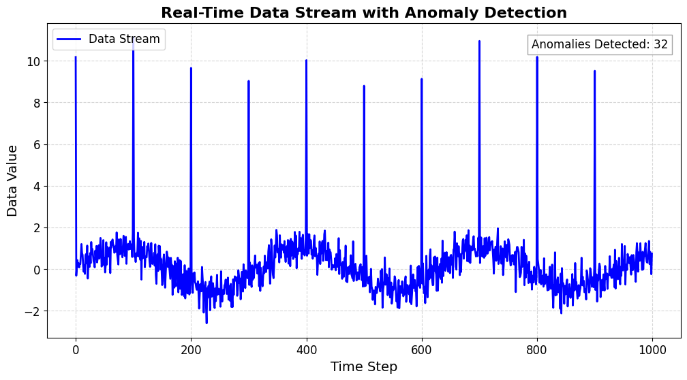

# Anomaly Detection in Data Streams

## Table of Contents
1. [Project Overview](#project-overview)
2. [Objectives](#objectives)
3. [Algorithm Overview](#algorithm-overview)
4. [Installation](#installation)
5. [Usage](#usage)
6. [How It Works](#how-it-works)
7. [Optimization and Performance](#optimization-and-performance)
8. [Visualization](#visualization)
9. [Conclusion](#conclusion)
    
## Project Overview
This project implements a real-time anomaly detection system designed to identify irregular patterns within simulated data streams. By leveraging seasonal patterns and random noise, the system accurately detects anomalies and provides insightful visualizations to aid in analysis.

## Objectives
The primary objectives of this project include:
- **Algorithm Selection**: Identify and implement an effective anomaly detection algorithm capable of adapting to concept drift and seasonal variations in data.
- **Data Stream Simulation**: Design a function that emulates a data stream, incorporating regular patterns, seasonal elements, and random noise to create realistic scenarios for testing.
- **Anomaly Detection**: Develop a real-time mechanism to accurately flag anomalies as they occur within the data stream.
- **Optimization**: Ensure that the anomaly detection algorithm is optimized for both speed and efficiency, allowing for rapid processing of data streams.
- **Visualization**: Create an intuitive real-time visualization tool that displays both the data stream and any detected anomalies for easy interpretation.

## Algorithm Overview
### Z-score Based Anomaly Detection
The core algorithm implemented in this project is a **Z-score based method** for anomaly detection. The Z-score measures how many standard deviations a data point is from the mean of a rolling window of previous values. 

#### Key Components:
- **Rolling Window**: A defined number of previous data points used to calculate the mean and standard deviation. This allows the algorithm to adapt to recent changes in the data stream.
- **Thresholding**: A defined Z-score threshold that determines what constitutes an anomaly. If the absolute value of the Z-score exceeds this threshold, the data point is flagged as an anomaly.

### Effectiveness
- **Adaptability**: The rolling window approach allows the algorithm to adjust to changes in the underlying data distribution, making it effective in dynamic environments.
- **Real-time Performance**: Anomalies are detected as they occur, facilitating timely responses to irregularities in the data.
- **Simplicity and Transparency**: The Z-score method is straightforward to implement and understand, making it accessible for rapid development and deployment.

## Installation
To set up the project locally, follow these steps:
1. Clone the repo:
   ```bash
   https://github.com/bruno-noir/Efficient-Data-Stream-Anomaly-Detection_20CH30058
   
2. Navigate to the project directory:
   ```bash
   cd efficient-data-stream-anomaly-detection_20CH30058

3. Create and activate a virtual environment (optional but recommended):
   ```bash
   python -m venv myenv
    source myenv/bin/activate  # On Windows use `myenv\Scripts\activate`

3. Install the required dependencies:
   ```bash
   pip install -r requirements.txt
   
## Usage
1. To run the anomaly detection system, execute the following command in your terminal:
    ```bash
     pip install -r requirements.txt
  
This will generate a simulated data stream, detect anomalies in real-time, and display the results.

### Example Visualization

Here’s an example of the anomaly detection in action:



## How It Works

### Data Stream Generation
The `data_stream` function creates a stream of data points, incorporating seasonal patterns and noise. Anomalies are artificially introduced at regular intervals to simulate real-world scenarios, allowing for effective testing of the anomaly detection system.

### Anomaly Detection
The `anomaly_detection` function utilizes the Z-score method to analyze the data stream. It calculates the Z-score for each data point based on the rolling mean and standard deviation of the previous values. Points that exceed a defined Z-score threshold are flagged as anomalies, enabling real-time identification of unusual patterns in the data.

### Real-time Visualization
The `visualization` function visualizes the data stream and highlights detected anomalies in real-time. This interactive experience provides users with immediate feedback on data behavior and the occurrence of anomalies.

## Optimization and Performance
The algorithm is optimized for speed and efficiency by leveraging:
- **Efficient Data Structures**: Deques are used to maintain the rolling window of values, enhancing performance.
- **Adjustable Parameters**: Key parameters, including window size, threshold, and noise level, can be adjusted for different datasets to improve detection accuracy.
- **Exponential Moving Averages (EMAs)**: The implementation of EMAs allows for faster convergence to underlying data trends, improving the responsiveness of anomaly detection.

## Visualization
The visualization component of the project provides real-time feedback on the data stream. The `visualization` function employs Matplotlib to:
- Plot the data stream in blue.
- Highlight detected anomalies in red.
- Dynamically update the plot title to indicate the number of anomalies detected.

This feature allows users to easily monitor the data and understand the impact of anomalies as they occur.

## Conclusion
This project successfully implements a robust system for detecting anomalies in data streams, providing valuable insights into data behavior and enabling proactive responses to irregularities. The combination of real-time detection, simulation of realistic data patterns, and intuitive visualizations makes this tool a powerful asset for data analysis.


